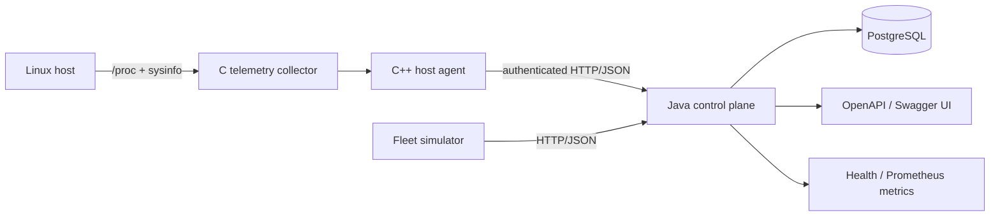

# NorthStar

NorthStar is a hybrid-cloud server management platform built around native Linux telemetry, a C++ host agent, a Java control plane, PostgreSQL persistence, REST/OpenAPI contracts, and repeatable fleet simulation.

> **Status:** active build. The repository implements host registration, authenticated heartbeat/telemetry, retry-safe command delivery, PostgreSQL-backed control-plane APIs, operator read/admin authorization, durable command auditing, health probes, and Prometheus metrics.

## Architecture



### Components

- **C telemetry collector** — samples Linux CPU, memory, load, uptime, and process counts.
- **C++ host agent** — registers a host, streams telemetry, retries with jittered backoff, and locally spools failed samples.
- **Java control plane** — Spring Boot REST service with per-host agent authentication, read/admin operator authorization, retry-safe command leases, durable command lifecycle auditing, health probes, and Prometheus instrumentation.
- **PostgreSQL** — stores hosts, credential hashes, telemetry samples, command state, and command audit events.
- **Fleet simulator** — Python stdlib load generator for deterministic multi-host test runs.
- **Delivery** — Docker Compose for local deployment, GitHub Actions and Jenkins for CI.

## Quick start

```bash
docker compose up --build
```

Control plane: `http://localhost:8080`  
Swagger UI: `http://localhost:8080/swagger-ui.html`  
Health: `http://localhost:8080/actuator/health`  
Prometheus metrics: `http://localhost:8080/actuator/prometheus`

Run simulated hosts:

```bash
python3 tools/simulate_fleet.py --hosts 100 --samples 3
```

Build the native collector + agent. Agent credentials are explicit: the process refuses to start without a token of at least 24 characters, and the server stores only its SHA-256 digest.

```bash
cmake -S . -B build
cmake --build build -j
export NORTHSTAR_AGENT_TOKEN='replace-with-a-random-secret-at-least-24-chars'
NORTHSTAR_ONCE=1 ./build/northstar-agent
```

Agent-originated heartbeat, telemetry, command leasing, and acknowledgement calls authenticate with `X-NorthStar-Agent-Token`. Rotate a credential through `POST /api/v1/hosts/{id}/credentials/rotate` while presenting the current token. Rotation invalidates the old token immediately.

Operator-facing APIs use `X-NorthStar-Operator-Key`. Set `NORTHSTAR_OPERATOR_API_KEY` for the admin credential and optionally `NORTHSTAR_OPERATOR_READ_API_KEY` for a read-only credential. The read-only role may use GET/HEAD operator routes but receives `403 Forbidden` for mutations; invalid or missing credentials receive `401 Unauthorized`. Agent-only routes remain outside this operator boundary.

Command queue, lease, and acknowledgement transitions append durable audit events transactionally with the corresponding command state change. Audit entries expose actor class and non-secret lifecycle details without copying lease credentials. Read-only operators may inspect the ordered history through `GET /api/v1/commands/{id}/audit`.

## API surface

| Method | Path | Purpose |
|---|---|---|
| POST | `/api/v1/hosts` | Register/provision a host credential |
| GET | `/api/v1/hosts` | List hosts |
| GET | `/api/v1/hosts/{id}` | Read host metadata |
| DELETE | `/api/v1/hosts/{id}` | Remove a host |
| POST | `/api/v1/hosts/{id}/heartbeat` | Authenticated liveness update |
| POST | `/api/v1/hosts/{id}/credentials/rotate` | Rotate agent credential |
| POST | `/api/v1/hosts/{id}/telemetry` | Authenticated telemetry ingestion |
| GET | `/api/v1/hosts/{id}/telemetry` | Read recent telemetry |
| GET | `/api/v1/hosts/{id}/status` | Resolve online/offline state |
| POST | `/api/v1/commands` | Queue a command |
| GET | `/api/v1/commands/{id}` | Read command state |
| GET | `/api/v1/commands/{id}/audit` | Read ordered durable command audit history |
| POST | `/api/v1/hosts/{id}/commands/lease` | Authenticated atomic command lease |
| POST | `/api/v1/commands/{id}/ack` | Authenticated token-bound acknowledgement |
| GET | `/actuator/health` | Liveness/readiness health information |
| GET | `/actuator/prometheus` | Prometheus-format service/JVM metrics |

See [docs/ARCHITECTURE.md](docs/ARCHITECTURE.md) and [docs/ROADMAP.md](docs/ROADMAP.md).
