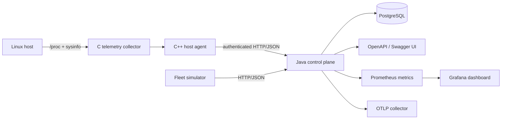

# NorthStar

NorthStar is a hybrid-cloud server management platform built around native Linux telemetry, a C++ host agent, a Java control plane, PostgreSQL persistence, REST/OpenAPI contracts, and repeatable fleet simulation.

> **Status:** active build. The repository implements host registration, authenticated heartbeat/telemetry, retry-safe command delivery, PostgreSQL-backed control-plane APIs, operator read/admin authorization, durable command auditing, health probes, Prometheus metrics, a provisioned Grafana control-plane dashboard, and OTLP trace export plumbing.

## Architecture



### Components

- **C telemetry collector** — samples Linux CPU, memory, load, uptime, and process counts.
- **C++ host agent** — registers a host, streams telemetry, signs telemetry bodies with HMAC-SHA256, retries with jittered backoff, and locally spools failed samples. Successful spool drains rewrite the remaining queue through a temporary file plus atomic rename, so an interrupted rewrite cannot truncate unsent samples.
- **Java control plane** — Spring Boot REST service with per-host agent authentication, replay-safe signed agent-mutation enforcement, read/admin operator authorization, retry-safe command leases, durable command lifecycle auditing, health probes, Prometheus instrumentation, and Micrometer/OpenTelemetry tracing.
- **PostgreSQL** — stores hosts, credential hashes, telemetry samples, command state, and command audit events.
- **Observability stack** — Prometheus scrapes the control plane, Grafana is provisioned with a lifecycle dashboard, and the local Compose stack includes an OpenTelemetry Collector receiving OTLP/HTTP traces and emitting them through its debug exporter.
- **Fleet simulator** — Python stdlib load generator for deterministic multi-host test runs.
- **Delivery** — Docker Compose for local deployment, GitHub Actions and Jenkins for CI.

## Quick start

```bash
docker compose up --build
```

Control plane: `http://localhost:8080`  
Swagger UI: `http://localhost:8080/swagger-ui.html`  
Health: `http://localhost:8080/actuator/health`  
Prometheus metrics: `http://localhost:8080/actuator/prometheus`  
Prometheus UI: `http://localhost:9090`  
Grafana: `http://localhost:3000` (anonymous Viewer, loopback-only)  
OTLP/HTTP receiver: `http://localhost:4318` (loopback-only)

Prometheus, Grafana, and OTLP receiver ports are intentionally bound to `127.0.0.1` in the development Compose stack. Do not expose the anonymous Grafana configuration or development collector ports on a shared or public interface; production authentication is deployment-specific and remains future work.

Run simulated hosts:

```bash
python3 tools/simulate_fleet.py --hosts 100 --samples 3
```

Build and test the native collector + agent. Agent credentials are explicit: the process refuses to start without a token of at least 24 characters, and the server stores only its SHA-256 digest.

```bash
cmake -S . -B build
cmake --build build -j
ctest --test-dir build --output-on-failure
export NORTHSTAR_AGENT_TOKEN='replace-with-a-random-secret-at-least-24-chars'
NORTHSTAR_ONCE=1 ./build/northstar-agent
```

Agent-originated heartbeat, telemetry, command leasing, acknowledgement, and credential rotation calls authenticate with `X-NorthStar-Agent-Token`. When `NORTHSTAR_SECURITY_REQUIRE_AGENT_SIGNATURES=true`, every post-registration agent mutation must also carry an HMAC-SHA256 signature over method, path, timestamp, nonce, and the exact body hash; the control plane rejects stale, replayed, body-tampered, or incorrectly signed requests. Command acknowledgement resolves the owning host before verification so the same per-host credential boundary applies even though the host ID is not present in the acknowledgement URL. Docker Compose enables enforcement; standalone deployments may opt in with the same setting. The current C++ agent emits signed live and spooled telemetry; other agent mutation APIs are ready for signed clients as command/heartbeat behavior is added. Rotate a credential through `POST /api/v1/hosts/{id}/credentials/rotate` while signing with and presenting the current token. Rotation invalidates the old token immediately.

Operator-facing APIs use `X-NorthStar-Operator-Key`. Set `NORTHSTAR_OPERATOR_API_KEY` for the admin credential and optionally `NORTHSTAR_OPERATOR_READ_API_KEY` for a read-only credential. The read-only role may use GET/HEAD operator routes but receives `403 Forbidden` for mutations; invalid or missing credentials receive `401 Unauthorized`. Agent-only routes remain outside this operator boundary.

Command queue, lease, and acknowledgement transitions append durable audit events transactionally with the corresponding command state change. Audit entries expose actor class and non-secret lifecycle details without copying lease credentials. Read-only operators may inspect the ordered history through `GET /api/v1/commands/{id}/audit`.

Prometheus includes NorthStar lifecycle counters for accepted telemetry, newly queued commands, lease deliveries, successful acknowledgements, acknowledgement conflicts, and agent authentication failures. Idempotent command-create replays do not inflate the queued counter; redelivery after a lease expires is intentionally counted as another lease delivery. HTTP request histograms are enabled so the provisioned dashboard can compute p95 latency from Prometheus buckets.

The control plane includes Micrometer's OpenTelemetry bridge and OTLP exporter. `NORTHSTAR_TRACE_SAMPLE_PROBABILITY` controls sampling and defaults to `1.0` while the project is under development. Named domain observations cover telemetry ingestion and command queue/lease/ack persistence, carrying host and command UUIDs as high-cardinality trace attributes so lifecycle stages can be correlated without creating high-cardinality Prometheus labels. Docker Compose routes OTLP/HTTP to the bundled development collector, whose debug exporter makes received spans visible in `docker compose logs otel-collector`. This wiring is not a claim of durable trace storage or production deployment; v0.3 remains open until end-to-end lifecycle traces are exercised and verified.

## API surface

| Method | Path | Purpose |
|---|---|---|
| POST | `/api/v1/hosts` | Register/provision a host credential |
| GET | `/api/v1/hosts` | List hosts |
| GET | `/api/v1/hosts/{id}` | Read host metadata |
| DELETE | `/api/v1/hosts/{id}` | Remove a host |
| POST | `/api/v1/hosts/{id}/heartbeat` | Authenticated + signed liveness update when signature enforcement is enabled |
| POST | `/api/v1/hosts/{id}/credentials/rotate` | Authenticated + signed credential rotation when signature enforcement is enabled |
| POST | `/api/v1/hosts/{id}/telemetry` | Authenticated + signed telemetry ingestion when signature enforcement is enabled |
| GET | `/api/v1/hosts/{id}/telemetry` | Read recent telemetry |
| GET | `/api/v1/hosts/{id}/status` | Resolve online/offline state |
| POST | `/api/v1/commands` | Queue a command |
| GET | `/api/v1/commands/{id}` | Read command state |
| GET | `/api/v1/commands/{id}/audit` | Read ordered durable command audit history |
| POST | `/api/v1/hosts/{id}/commands/lease` | Authenticated + signed atomic command lease when signature enforcement is enabled |
| POST | `/api/v1/commands/{id}/ack` | Authenticated + signed token-bound acknowledgement when signature enforcement is enabled |
| GET | `/actuator/health` | Liveness/readiness health information |
| GET | `/actuator/prometheus` | Prometheus-format service/JVM and NorthStar lifecycle metrics |

See [docs/ARCHITECTURE.md](docs/ARCHITECTURE.md) and [docs/ROADMAP.md](docs/ROADMAP.md).
