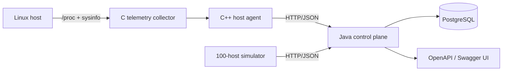

# NorthStar

NorthStar is a hybrid-cloud server management platform built around native Linux telemetry, a C++ host agent, a Java control plane, PostgreSQL persistence, REST/OpenAPI contracts, and repeatable fleet simulation.

> **Status:** active build. The repository implements the first end-to-end slice: host registration, heartbeat, telemetry ingestion/query, status, and command lifecycle APIs.

## Architecture



### Components

- **C telemetry collector** — samples Linux CPU, memory, load, uptime, and process counts.
- **C++ host agent** — wraps the collector, registers a host, and streams telemetry over HTTP.
- **Java control plane** — Spring Boot REST service with 12 management endpoints.
- **PostgreSQL** — stores hosts, telemetry samples, and command state.
- **Fleet simulator** — Python stdlib load generator for deterministic multi-host test runs.
- **Delivery** — Docker Compose for local deployment, GitHub Actions and Jenkins for CI.

## Quick start

```bash
docker compose up --build
```

Control plane: `http://localhost:8080`  
Swagger UI: `http://localhost:8080/swagger-ui.html`

Run 100 simulated hosts:

```bash
python3 tools/simulate_fleet.py --hosts 100 --samples 3
```

Build the native collector + agent:

```bash
cmake -S . -B build
cmake --build build -j
NORTHSTAR_ONCE=1 ./build/northstar-agent
```

## API surface

| Method | Path | Purpose |
|---|---|---|
| POST | `/api/v1/hosts` | Register a host |
| GET | `/api/v1/hosts` | List hosts |
| GET | `/api/v1/hosts/{id}` | Read host metadata |
| DELETE | `/api/v1/hosts/{id}` | Remove a host |
| POST | `/api/v1/hosts/{id}/heartbeat` | Refresh liveness |
| POST | `/api/v1/hosts/{id}/telemetry` | Ingest telemetry |
| GET | `/api/v1/hosts/{id}/telemetry` | Read recent telemetry |
| GET | `/api/v1/hosts/{id}/status` | Resolve online/offline state |
| POST | `/api/v1/commands` | Queue a command |
| GET | `/api/v1/commands/{id}` | Read command state |
| GET | `/api/v1/hosts/{id}/commands` | Poll queued commands |
| POST | `/api/v1/commands/{id}/ack` | Acknowledge a command |

See [docs/ARCHITECTURE.md](docs/ARCHITECTURE.md) and [docs/ROADMAP.md](docs/ROADMAP.md).
